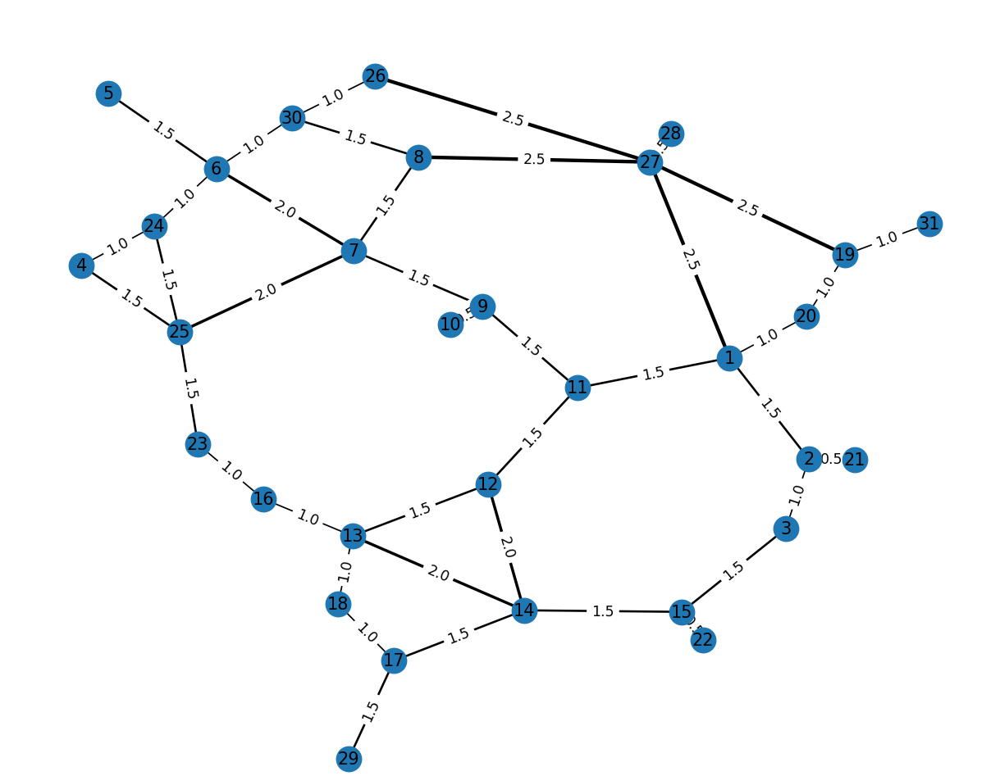
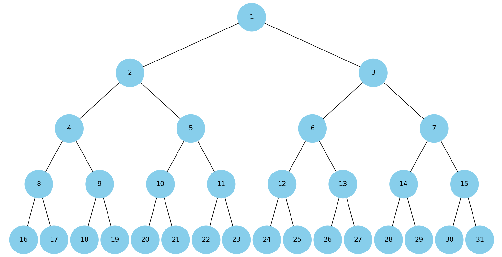
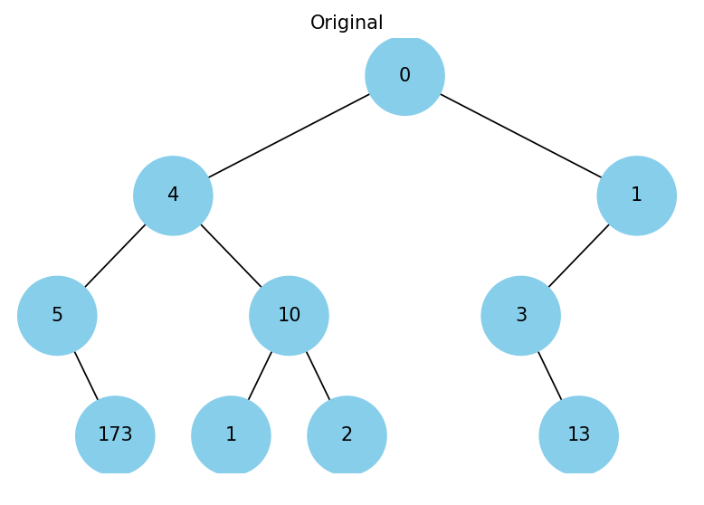
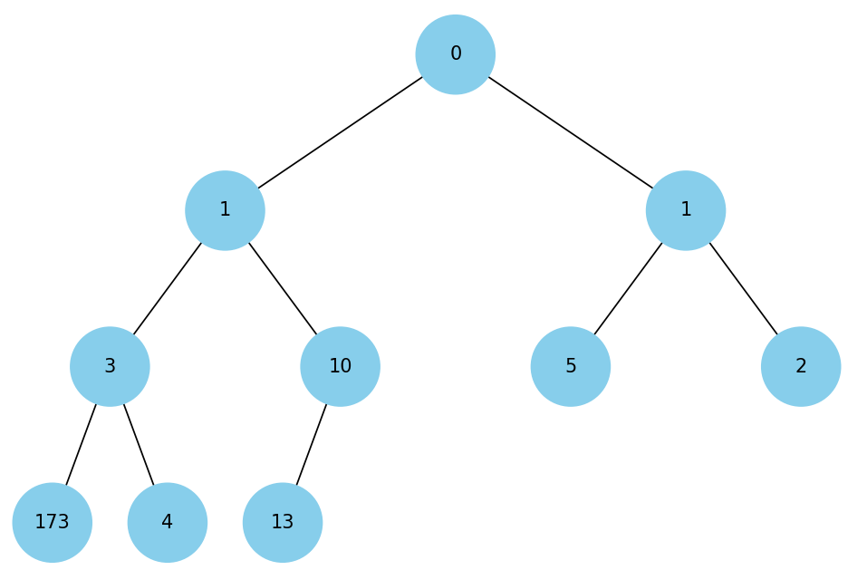
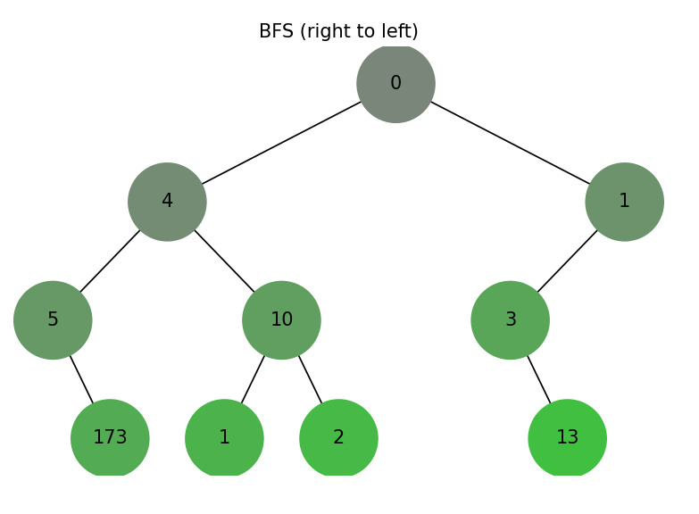
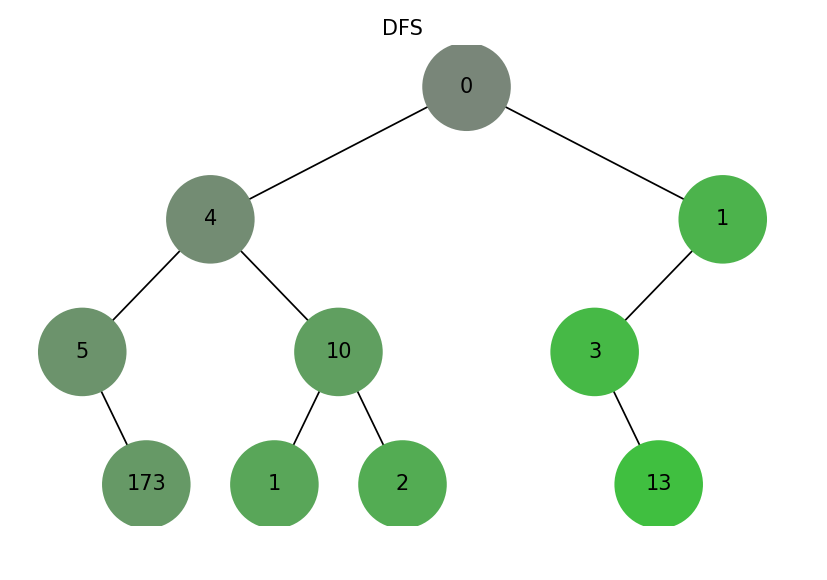
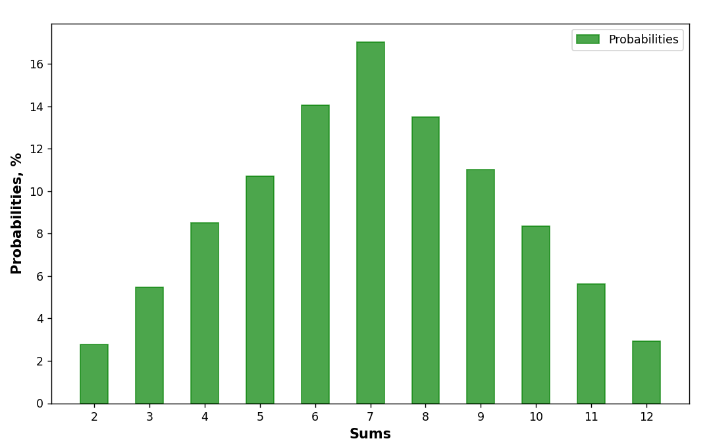

# goit-algo-fp

## Results

### Results Task 3

Let's build a weighted graph to be used later in the task:

Let's represent the graph as a heap:

Shortest paths for the graph (using the binary heap as a sorter), look as follows:

**Leaf nodes:** [16, 17, 18, 19, 20, 21, 22, 23, 24, 25, 26, 27, 28, 29, 30, 31]

Given the list of the leaf nodes above, let's take each of those as a starting point on the graph, and find the shortest path to each next leaf using Dijkstra's algorithm:

- Shortest path from 16 to 17: [16, 13, 18, 17]
- Shortest path from 17 to 18: [17, 18]
- Shortest path from 18 to 19: [18, 13, 12, 11, 1, 20, 19]
- Shortest path from 19 to 20: [19, 20]
- Shortest path from 20 to 21: [20, 1, 2, 21]
- Shortest path from 21 to 22: [21, 2, 3, 15, 22]
- Shortest path from 22 to 23: [22, 15, 14, 13, 16, 23]
- Shortest path from 23 to 24: [23, 25, 24]
- Shortest path from 24 to 25: [24, 25]
- Shortest path from 25 to 26: [25, 24, 6, 30, 26]
- Shortest path from 26 to 27: [26, 27]
- Shortest path from 27 to 28: [27, 28]
- Shortest path from 28 to 29: [28, 27, 1, 11, 12, 14, 17, 29]
- Shortest path from 29 to 30: [29, 17, 18, 13, 16, 23, 25, 24, 6, 30]
- Shortest path from 30 to 31: [30, 26, 27, 19, 31]

### Results Task 4

Visualize the binary tree:

Represent it as a heap:

### Results Task 5

Using the binary tree from task 4, illustrate the BFS algorithm coverage progression (right to left):

as well as the DFS algorithm coverage progression (top-down)

### Results Task 7

The following are the probabilities obtained from an algorithm that utilizes dynamic programming, as well as their true probabilities:

- 2: 2.91  | 2.78
- 3: 5.57  | 5.56
- 4: 8.14  | 8.33
- 5: 11.49 | 11.11
- 6: 14.1  | 13.89
- 7: 16.18 | 16.67
- 8: 14.5  | 13.89
- 9: 11.14 | 11.11
- 10: 7.74 | 8.33
- 11: 5.48 | 5.56
- 12: 2.75 | 2.78

After the comparison is drawn, certain pecuilarities transpire:

1. Despite being very representative of the true results, those produced by the algorithm are less precise (for an experiment of 10,000 throws);
2. The resulting probabilities showcase satisfactory gaussian distribution of data, as compared to the true probabilities